# Laporan Ketidaksesuaian Diagram Bab 3 dengan Kode Java

Tanggal audit: 20 April 2026  
Auditor: GitHub Copilot  
Sumber kode: `tugasakhir/src/main/java/com/uhn/pmb/`

---

## 🔴 KRITIS — Gambar Harus Dibuat Ulang

### 1. `figure/class-diagram.png` — Struktur Entitas Salah Total

**Masalah:**
- Diagram menampilkan `AdminPusat`, `AdminValidasi`, dan `Camaba` sebagai **class terpisah** — ini salah besar.
- Di kode nyata, hanya ada **satu entity `User`** dengan enum `UserRole` (`STUDENT`, `ADMIN_PUSAT`, `ADMIN_VALIDASI`). Tidak ada class `AdminPusat` atau `AdminValidasi` sama sekali.
- `Camaba` di diagram seharusnya adalah entity **`Student`** (dengan atribut: `fullName`, `nik`, `birthDate`, `birthPlace`, `gender`, `address`, `phoneNumber`, `parentName`, `parentPhone`, `schoolOrigin`, `schoolYear`) yang berelasi `@OneToOne` ke `User`.
- `KonfigurasiSistem` di diagram punya atribut `periode`, `harga_formulir`, `batas_pendaftaran` — di kode nyata ini adalah tiga entity terpisah: `RegistrationPeriod` (periode), `ProgramStudi` (harga per prodi), dan `SystemConfiguration` (key-value store untuk konfigurasi).
- `FormulirPendaftaran` punya `virtual_account: string` — di kode nyata `VirtualAccount` adalah entity **terpisah**, bukan field di AdmissionForm.
- `NilaiUjian` di diagram → di kode nyata ada `ExamResult` dan `ExamSubmission` sebagai entity terpisah.
- `DataDaftarUlang` → di kode nyata ada `ReEnrollment`, `ReEnrollmentData`, `ReEnrollmentDocument`, `ReEnrollmentValidation` sebagai entity terpisah.

**Entity yang sama sekali tidak ada di diagram tapi ada di kode:**
`ExamToken`, `CicilanRequest`, `SelectionType`, `GelombangLinkUjian`, `FormValidation`, `VirtualAccount`, `PaymentBriva`, `Announcement`, `SystemLink`, `ContactInfo`, `AdminMessage`, `PublicationSchedule`, `HasilAkhir`, `StudentNPM`, dll.

**Yang harus dilakukan:** Buat ulang class diagram dengan struktur berikut:
- `User` (id, email, password, role: UserRole, isActive, emailVerified) → implements UserDetails
- `UserRole` enum: STUDENT, ADMIN_PUSAT, ADMIN_VALIDASI
- `Student` @OneToOne → `User` (id, fullName, nik, birthDate, birthPlace, gender, address, phoneNumber, parentName, parentPhone, schoolOrigin, schoolYear)
- `AdmissionForm` @ManyToOne → `Student`, @ManyToOne → `RegistrationPeriod`
- `FormValidation` @OneToOne → `AdmissionForm`
- `VirtualAccount` @OneToOne → `AdmissionForm`
- `CicilanRequest` @ManyToOne → `Student`
- `Exam` @ManyToOne → `Student`, `ExamToken`, `ExamResult`
- `ReEnrollment` @OneToOne → `Student`
- `HasilAkhir` @OneToOne → `Student`
- `RegistrationPeriod`, `ProgramStudi`, `SelectionType`

> ⚠️ Teks deskripsi di chapter-3.tex sudah **benar** menggambarkan kode, tapi **gambarnya yang salah**.

---

### 2. `figure/erd.png` — Entitas Database Salah

**Masalah:**
- Diagram menampilkan `CAMABA`, `Admin_Pusat`, `Admin_Validasi` sebagai entity/tabel terpisah — **salah**. Di database nyata hanya ada **satu tabel `users`** dengan kolom `role` (STUDENT/ADMIN_PUSAT/ADMIN_VALIDASI).
- Tidak ada tabel `students` yang terpisah di ERD — padahal di kode ada tabel `students` yang menyimpan profil camaba dengan `user_id` sebagai foreign key.
- Entity `Formulir` terlalu disederhanakan — tabel nyata `admission_forms` punya kolom `jenis_seleksi_id`, `selection_type_id`, `form_type`, `program_studi_1/2/3`, dan puluhan kolom data pribadi.
- Entity `Pembayaran` tidak merepresentasikan tabel nyata `virtual_accounts` dan `payment_briva` yang terpisah.
- Entity `Ujian` terlalu sederhana — di kode nyata ada `exams`, `exam_results`, `exam_submissions`, `exam_tokens` sebagai tabel terpisah.
- Missing di ERD: `exam_tokens`, `cicilan_requests`, `program_studi`, `selection_types`, `gelombang_link_ujian`, `form_validations`, `re_enrollment_documents`, `hasil_akhir`, `system_links`, `announcements`, dll.

**Yang harus dilakukan:** Buat ulang ERD berbasis tabel database nyata. Minimal tampilkan:
- `users` (id, email, password, role, is_active, email_verified)
- `students` (id, user_id FK, full_name, nik, birth_date, birth_place, gender, address, ...)
- `admission_forms` (id, student_id FK, period_id FK, jenis_seleksi_id, selection_type_id, form_type, program_studi_1/2/3, full_name, nik, ...)
- `virtual_accounts` (id, admission_form_id FK, no_va, nominal, status)
- `cicilan_requests` (id, student_id FK, jumlah_cicilan, status)
- `registration_periods` (id, name, start_date, end_date, is_active)
- `program_studi` (id, kode, nama, fakultas, harga, cicilan_1 s.d. cicilan_6)
- `exams` (id, student_id FK, exam_link_id FK, status)
- `exam_tokens` (id, token, exam_link_id FK, is_used)
- `re_enrollments` (id, student_id FK, status)
- `hasil_akhir` (id, student_id FK, npm, status_kelulusan)

---

### 3. `figure/activity-pembayaran-formulir.png` — FILE SALAH/TERTUKAR

**Masalah KRITIS:**
- File ini berisi **gambar activity diagram LOGIN** (menampilkan alur Regristasi → Login → Menentukan Role → Dashboard) — bukan diagram alur pembayaran formulir.
- Ini adalah kesalahan file yang sangat serius: dua file mungkin tertukar atau file pembayaran belum pernah dibuat.

**Yang harus dilakukan:** Buat file baru `activity-pembayaran-formulir.png` dengan alur yang benar:
1. Login → Dashboard
2. Pilih Menu Pendaftaran → Pilih Gelombang Aktif
3. Sistem cek status gelombang (aktif/tutup)
4. Pilih Jenis Seleksi (jenis formulir)
5. Isi Formulir Pendaftaran dan Upload Dokumen → Submit
6. Sistem generate VA BRIVA → Kirim email notifikasi VA ke Camaba
7. Camaba bayar via BRIVA
8. Sistem verifikasi pembayaran → Update status Lunas → Notifikasi berhasil

---

## 🟡 SEDANG — Gambar Perlu Diperbaiki

### 4. `figure/activity-login-camaba.png` — Typo + Email vs Username

**Masalah:**
- Typo: **"Regristasi"** → seharusnya "Registrasi"
- Typo: **"Memvalidasri"** → seharusnya "Memvalidasi"
- Diagram menyebutkan **"Memeriksa Username dan password"** — di kode nyata login menggunakan **email** (bukan username). Entity `User` memakai `email` sebagai identifier, dan `getUsername()` mengembalikan `email`.

**Perbaikan:** Ganti teks "Username" → "Email" di dalam diagram. Perbaiki typo.

---

### 5. `figure/activity-daftar-ulang.png` — Alur Login Salah

**Masalah:**
- Diagram menampilkan login daftar ulang dengan **"Input Nomor ujian dan tanggal lahir"** — ini salah. Di kode nyata, camaba login menggunakan **email dan password** yang sama dengan proses pendaftaran (bukan nomor ujian).
- Diagram menampilkan **"Pilih Menu Ganti Password"** sebagai bagian dari alur daftar ulang — ini tidak relevan dengan proses daftar ulang.
- Teks chapter-3 mendeskripsikan alur: camaba lulus → login → pilih menu daftar ulang → isi formulir → submit → notif ke admin → admin validasi → terverifikasi/perlu revisi. Gambar tidak konsisten dengan teks.

**Perbaikan:** Hapus bagian "Input Nomor ujian dan tanggal lahir" serta "Ganti Password". Tunjukkan login biasa (email + password), lalu langsung ke alur daftar ulang.

---

### 6. `figure/activity-konfigurasi-admin.png` — Email vs Username + Fitur Tidak Ada

**Masalah:**
- Menampilkan **"Mengisi Username dan Password"** untuk tambah user — di kode nyata form tambah user menggunakan **email**, bukan username.
- Menampilkan **"Tambah/Edit/Hapus Field Form"** dan **"Set Status Wajib"** — fitur *dynamic form field management* ini **tidak ada** di kode nyata. Field formulir di kode bersifat tetap (hardcoded di entity `AdmissionForm`).
- Typo: **"Peringatan Ksealhan Data Login"** → seharusnya "Peringatan Kesalahan Data Login"

**Perbaikan:** Ganti "Username" → "Email". Hapus kotak "Tambah/Edit/Hapus Field Form" dan "Set Status Wajib" karena tidak sesuai kode. Perbaiki typo "Ksealhan".

---

### 7. `figure/activity-formulir-kartu-ujian.png` — Label Gelombang Membingungkan + Konten Terpotong

**Masalah:**
- Menampilkan **"Akses Formulir Gelombang 3"** di awal dan **"Akses Formulir Gelombang 2"** di tengah — label "Gelombang 3" dan "Gelombang 2" bersifat spesifik dan membingungkan; lebih tepat ditulis "Gelombang Aktif".
- Terdapat **kotak hitam besar** (black rectangle) di tengah diagram yang menutupi sebagian konten — ini adalah artefak editing yang mengganggu keterbacaan.
- Alur menampilkan "Menampilkan Halaman Pilih Metode" di bagian Gelombang 2 yang kemudian terpotong — tidak jelas apa yang terjadi selanjutnya.
- Langkah **pembayaran sebelum pengisian formulir** tidak terlihat jelas di diagram — padahal di kode, status pembayaran harus lunas sebelum formulir bisa diisi.

**Perbaikan:** Hapus black rectangle artifact. Ganti label "Gelombang 3/2" dengan "Gelombang Aktif". Tambahkan langkah pembayaran sebelum pengisian formulir.

---

## 🟢 RINGAN — Catatan Minor

### 8. `figure/use-case-diagram.png` — Typo + Use Case Tidak Lengkap

- Typo: **"Regristasi"** → "Registrasi"
- Use case **"Membuat VA Manual"** ada di tabel definisi use case di tex, tapi tidak tampil di diagram
- Beberapa use case dari kode tidak ada di diagram: cicilan, bulk download PDF, system links, pengumuman CRUD, token generation, status tracker
- **"Mengelola isi Formulir"** muncul di diagram tapi tidak ada di tabel definisi use case di tex — inkonsistensi

---

### 9. `figure/activity-ekspor-data.png` — Format Ekspor Tidak Sesuai

- Diagram menyebut format **"CSV/EXCEL"** — tapi chapter-3 text dan kode nyata mendukung **CSV, JSON, dan Cetak** (bukan Excel)
- Diagram menampilkan opsi "Kirim File ke admin pusat Melalui Gmail" — fitur ini tidak ada di kode nyata (hanya download langsung)
- Typo sama: "Peringatan Ksealhan Data Login" → "Kesalahan"

---

### 10. `figure/arsitektur-mvc.png` — Nama Controller Disederhanakan

- Diagram menampilkan `CamabaController, AdminController` — kode nyata punya controller lebih banyak: `AuthController`, `StudentController`, `AdminPusatController`, `AdminValidasiController`, `PaymentController`, dll.
- Label **"Result Test"** di sisi SQL database tidak lazim — lebih tepat "Result Set" atau "Response"
- Secara konsep diagram ini masih bisa diterima sebagai representasi arsitektur tingkat tinggi

---

## Ringkasan

| File | Tingkat | Status |
|------|---------|--------|
| `class-diagram.png` | 🔴 KRITIS | Buat ulang — struktur entity salah total |
| `erd.png` | 🔴 KRITIS | Buat ulang — entity database salah total |
| `activity-pembayaran-formulir.png` | 🔴 KRITIS | Buat baru — file berisi diagram login, bukan pembayaran |
| `activity-login-camaba.png` | 🟡 SEDANG | Perbaiki typo + ganti Username → Email + tambah end state |
| `activity-daftar-ulang.png` | 🟡 SEDANG | Perbaiki alur login + tambah end state di semua cabang |
| `activity-konfigurasi-admin.png` | 🟡 SEDANG | Ganti Username → Email, hapus dynamic field + tambah end state |
| `activity-formulir-kartu-ujian.png` | 🟡 SEDANG | Hapus black rectangle + tambah end state + perbaiki label |
| `activity-ekspor-data.png` | 🟡 SEDANG | Ganti Excel → JSON/Cetak + tambah end state + perbaiki typo |
| `activity-proses-ujian.png` | 🟡 SEDANG | Tambah end state di cabang error |
| `sequence-user-login.png` | 🟡 SEDANG | Kolom terlalu rapat — perlebar jarak antar lifeline |
| `sequence-pendaftaran-ujian.png` | 🟡 SEDANG | Kolom terlalu rapat — perlebar jarak antar lifeline |
| `sequence-daftar-ulang.png` | 🟡 SEDANG | Kolom agak rapat — perlebar sedikit |
| `use-case-diagram.png` | 🟢 RINGAN | Perbaiki typo, tambah use case yang hilang |
| `arsitektur-mvc.png` | 🟢 RINGAN | Opsional — bisa diterima sebagai diagram tingkat tinggi |
| `sequence-validasi.png` | ✅ OK | Jarak lifeline sudah cukup |
| `sequence-konfigurasi.png` | ✅ OK | Jarak lifeline sudah cukup |
| `diagram-konteks.png` | ✅ OK | Sudah sesuai dengan kode dan kebutuhan fungsional |
| `alur-penelitian.png` | ✅ OK | Tidak terkait langsung dengan kode |
| Semua `ui-*.png` | ✅ OK | Mockup UI, tidak perlu diverifikasi ke kode |

---

---

# BAGIAN B — Masalah End State Activity Diagram

Semua activity diagram **wajib** memiliki simbol **Activity Final Node ⊙** (lingkaran penuh di dalam lingkaran) di **setiap jalur yang berakhir**, bukan hanya jalur sukses.

---

## B1. `activity-login-camaba.png` — End State Kurang di 3 Titik

**Yang sudah ada:** ⊙ hanya di bawah "Menampilkan Halaman Dashboard" (jalur sukses)

**Yang harus ditambahkan ⊙:**
1. Di bawah kotak **"Kembali Kehalaman Login"** — cabang setelah "Menampilkan Peringatan Akun Terdaftar"
2. Di bawah kotak **"Peringatan Kesalahan Email"** — cabang No dari verifikasi email lupa password
3. Di bawah kotak **"Peringatan Kesalahan Data Login"** — cabang No dari cek username/password

---

## B2. `activity-pembayaran-formulir.png` — File Ini DIAGRAM LOGIN, Bukan Pembayaran

File ini isinya sama persis dengan `activity-login-camaba.png` — file **salah total**. Harus dibuat ulang sebagai diagram pembayaran formulir (lihat Bagian C untuk prompt pembuatan ulang).

---

## B3. `activity-formulir-kartu-ujian.png` — End State Kurang + Black Rectangle

**Yang sudah ada:** ⊙ hanya di paling bawah kanan (jalur Gelombang 2 → Mengirim Notifikasi)

**Yang harus ditambahkan ⊙:**
1. Di bawah kotak **"Peringatan Kesalahan Input data"** — cabang No dari decision validasi data
2. Di bawah kotak **"Download Kartu Ujian"** — jalur ini harus punya end state sebelum lanjut ke Gelombang 2 ATAU tandai dengan merge node jika memang dilanjutkan
3. Di bawah kotak **"Melakukan Ujian"** — cabang ini menggantung tanpa end state

**Tambahan:** Hapus kotak hitam besar (black rectangle artifact) di tengah diagram.

---

## B4. `activity-proses-ujian.png` — End State Kurang di 3 Titik

**Yang sudah ada:** ⊙ hanya di jalur sukses "Menampilkan Status Kelulusan"

**Yang harus ditambahkan ⊙:**
1. Di bawah kotak **"Peringatan Kesalahan Nomor"** — cabang No dari validasi token
2. Di bawah kotak **"Peringatan Ujian Belum Dimulai"** — cabang "waktu belum sesuai"
3. Jika ada cabang "Admin menolak" hasil ujian → tambahkan ⊙

---

## B5. `activity-daftar-ulang.png` — End State Kurang di 2 Titik

**Yang sudah ada:** ⊙ tidak terlihat di semua cabang terminal

**Yang harus ditambahkan ⊙:**
1. Di bawah alur **"Terverifikasi"** → setelah "Status Terverifikasi" kirim ke camaba
2. Di bawah alur **"Perlu Revisi"** → setelah notifikasi revisi dikirim ke camaba (lalu panah loop kembali ke "Isi Formulir" atau end state tergantung desain)

---

## B6. `activity-konfigurasi-admin.png` — End State Kurang di 4 Titik

**Yang sudah ada:** ⊙ tidak ada sama sekali di diagram ini

**Yang harus ditambahkan ⊙:**
1. Di bawah **"Peringatan Ksealhan Data Login"** — cabang No dari cek login
2. Setelah **"Mengedit Akun Admin Validasi"** — jika alur selesai
3. Setelah **"Menghapus Akun Admin Validasi"** — jika alur selesai
4. Setelah **"Menyimpan konfigurasi sistem"** / akhir alur konfigurasi gelombang

---

## B7. `activity-ekspor-data.png` — End State Kurang di 2 Titik

**Yang sudah ada:** ⊙ hanya di bawah "pilih Download File" jalur bawah

**Yang harus ditambahkan ⊙:**
1. Di bawah **"Peringatan Ksealhan Data Login"** — cabang No dari cek login
2. Di bawah **"Kirim File ke admin pusat"** — cabang ini menggantung tanpa end state

---

---

# BAGIAN C — Masalah Sequence Diagram (Kolom Terlalu Rapat)

---

## C1. `sequence-user-login.png` — 8 Lifeline Terlalu Sesak

**Masalah:** Diagram memiliki 8 participant (User, Form Register, Control Register, Form Login, Control Login, Dashboard, Control Data, Database). Dengan lebar kanvas standar, jarak antar lifeline hanya ±1–2 cm sehingga pesan-pesan seperti "Validasi Pembuatan Gagal" dan "Validasi Pembuatan Berhasil" yang ada di sisi kanan **terpotong keluar dari bingkai** dan label panah berhimpitan.

**Perbaikan:**
- Perlebar kanvas diagram minimal **3× lebar saat ini** (dari ~800px ke ~2400px)
- Jarak antar lifeline minimal **200px**
- Font label pesan minimal **11pt** agar terbaca
- Atau kurangi participant: gabungkan "Form Register" + "Control Register" menjadi satu layer "RegisterModule", dan "Form Login" + "Control Login" menjadi "LoginModule"

---

## C2. `sequence-pendaftaran-ujian.png` — 9 Lifeline Paling Parah

**Masalah:** Diagram memiliki 9 participant (Camaba, UI_PMB, PMB Controller, Pembelian Formulir, Formulir Pendaftaran, Ujian, BRIVA, Google Form, Database). Ini adalah diagram yang **paling rapat** — label panah "Request ke BRIVA", "Nomor VA", "Simpan Nilai" dll. saling tumpang tindih dengan lifeline-lifeline yang berdempetan.

**Perbaikan:**
- Perlebar kanvas minimal **3500px**
- Jarak antar lifeline minimal **250px** karena ada 9 participant
- Atau pisah menjadi 2 diagram terpisah: (1) diagram alur pembayaran+formulir, (2) diagram alur ujian
- Hapus participant "Ujian" yang hanya menerima satu pesan — gabungkan ke "PMB Controller"

---

## C3. `sequence-daftar-ulang.png` — 6 Lifeline Agak Rapat

**Masalah:** Label "Menampilkan Halaman Dashboard PMB dan Peringatan" terlalu panjang dan memotong antar lifeline. "Tidak Diverifikasi" dan "Diverfikasi" (typo: harusnya "Diverifikasi") tumpang tindih di sisi Admin Validasi.

**Perbaikan:**
- Perlebar kanvas ~20%
- Perbaiki typo "Diverfikasi" → "Diverifikasi"
- Persingkat label panjang: "Menampilkan Dashboard PMB"

---

---

# BAGIAN D — Kode PlantUML Siap Render

**Cara pakai:**
1. Copy kode `@startuml` ... `@enduml` di bawah
2. Paste ke [plantuml.com/plantuml/uml/](https://www.plantuml.com/plantuml/uml/) atau VS Code extension PlantUML
3. Export PNG → Ganti file di folder `figure/`

> **Catatan D2:** `activity-pembayaran-formulir.png` filenya salah total (isinya diagram login), kode di bawah adalah diagram pembayaran dari nol.
> **Catatan D9:** `sequence-pendaftaran-ujian.png` dipecah jadi 2 diagram terpisah karena 9 lifeline terlalu padat.

---

## D1. `activity-login-camaba.png`

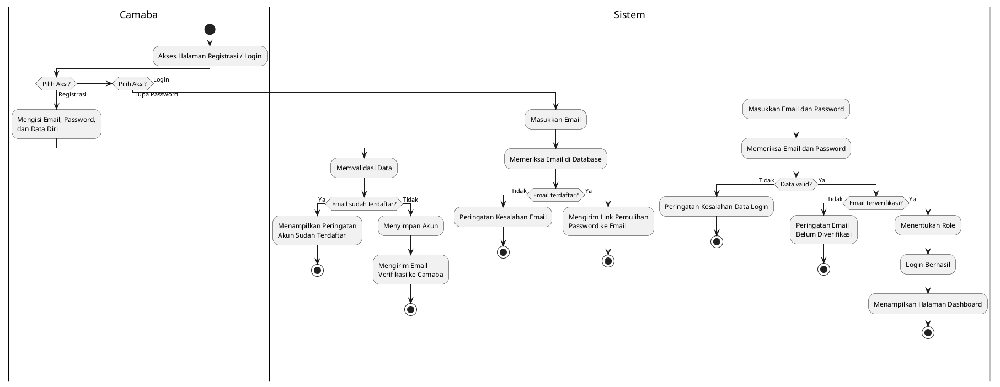

---

## D2. `activity-pembayaran-formulir.png` *(buat dari nol — file lama isinya salah)*

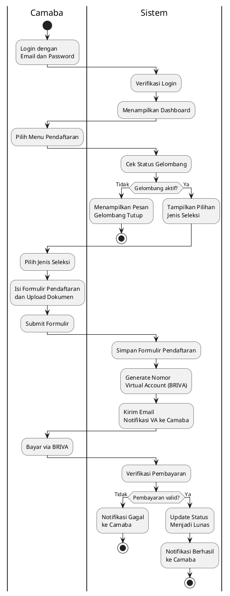

---

## D3. `activity-formulir-kartu-ujian.png`

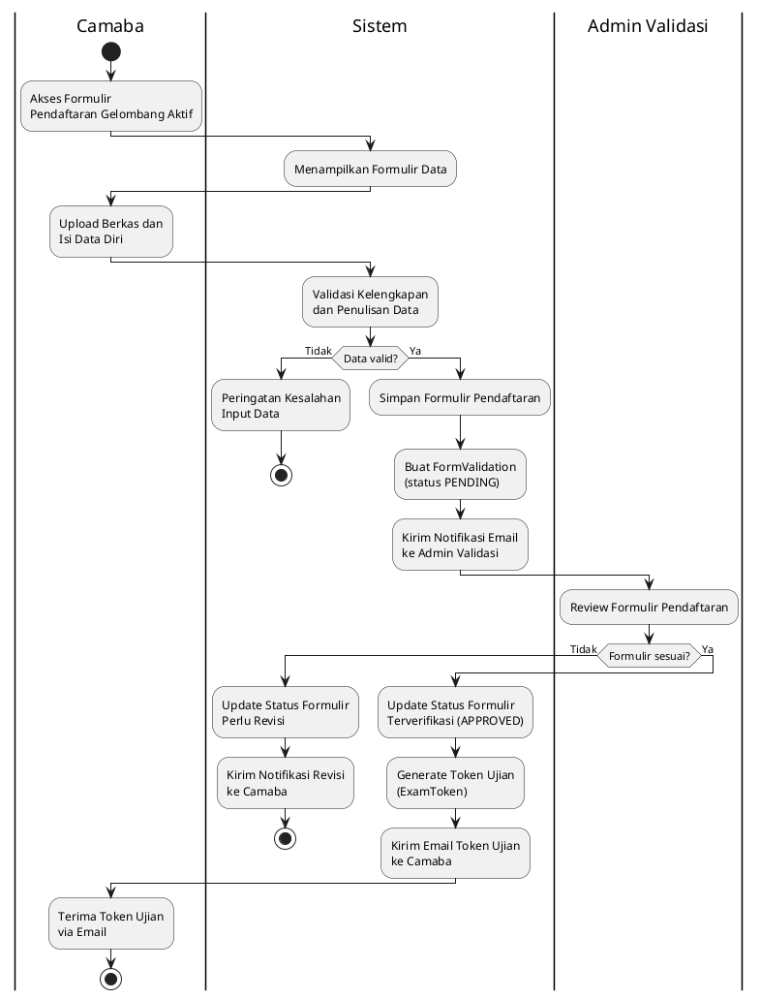

---

## D4. `activity-proses-ujian.png`

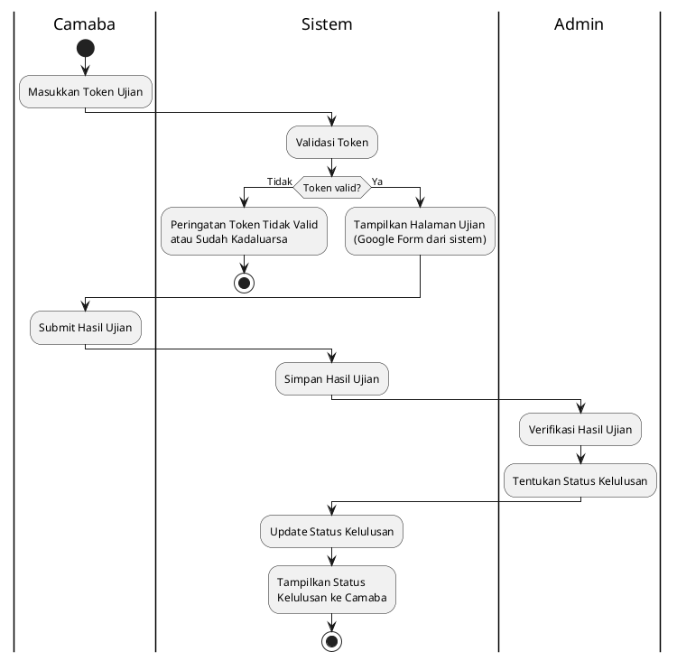

---

## D5. `activity-daftar-ulang.png`

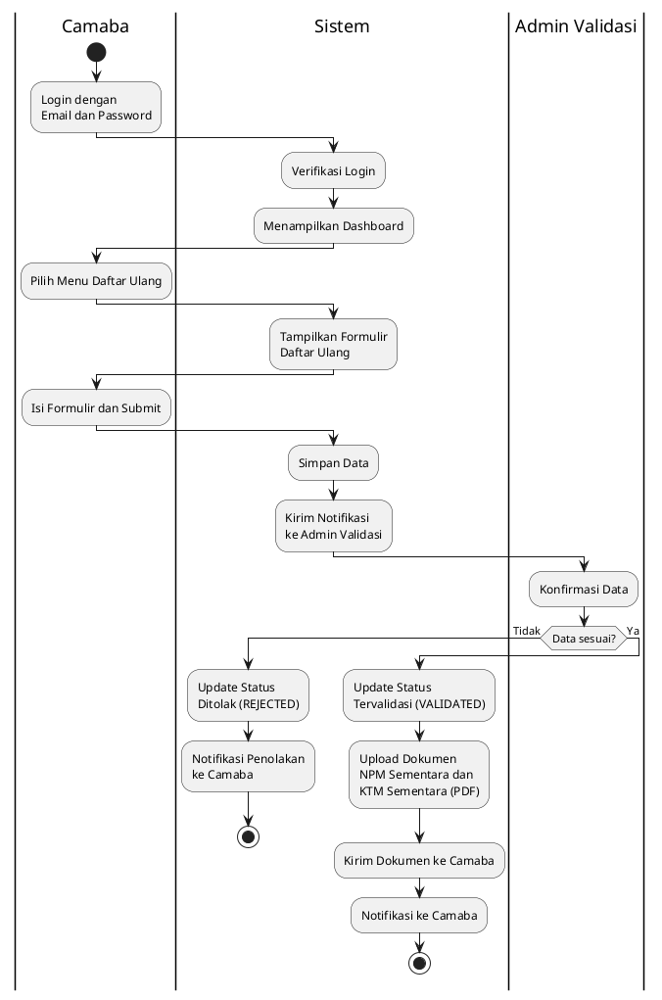

---

## D6. `activity-konfigurasi-admin.png`

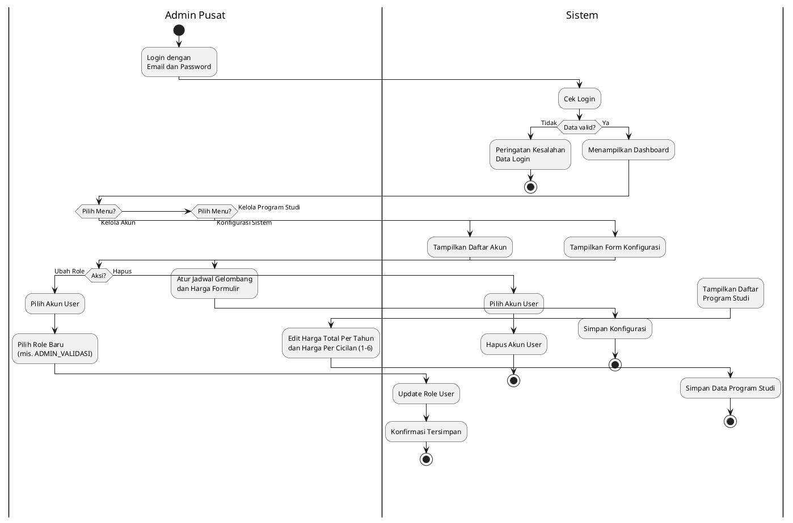

---

## D7. `activity-ekspor-data.png`

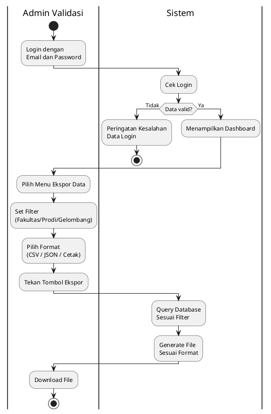

---

## D8. `sequence-user-login.png`

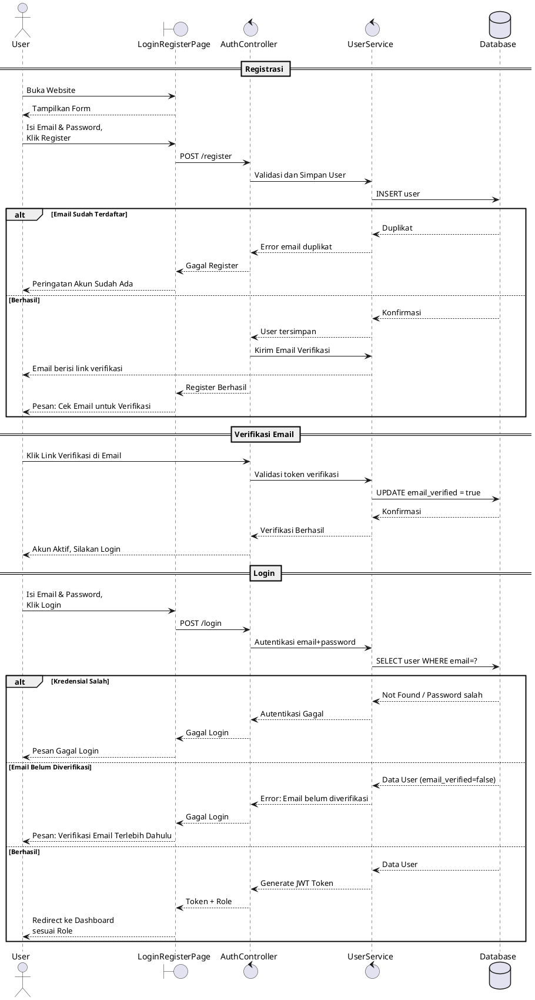

---

## D9a. `sequence-pendaftaran-formulir.png` *(Diagram 1 dari 2 - Formulir, VA & Pembayaran)*

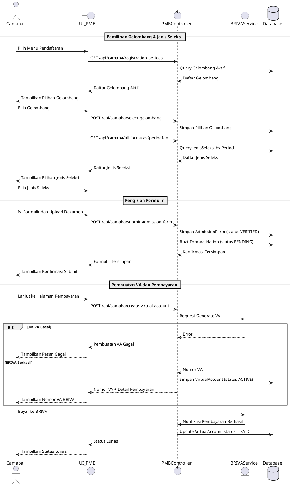

## D9b. `sequence-pendaftaran-ujian.png` *(Diagram 2 dari 2 — Proses Ujian)*

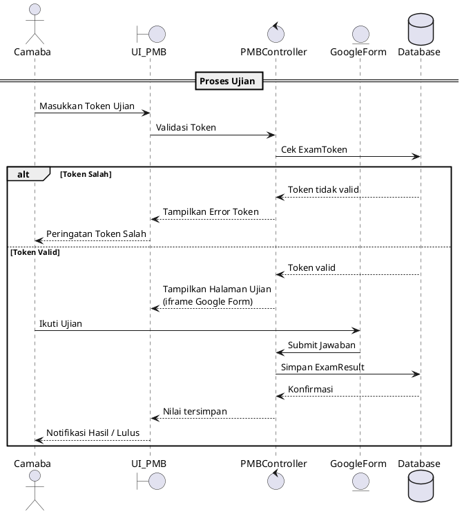

---

## D10. `sequence-daftar-ulang.png`

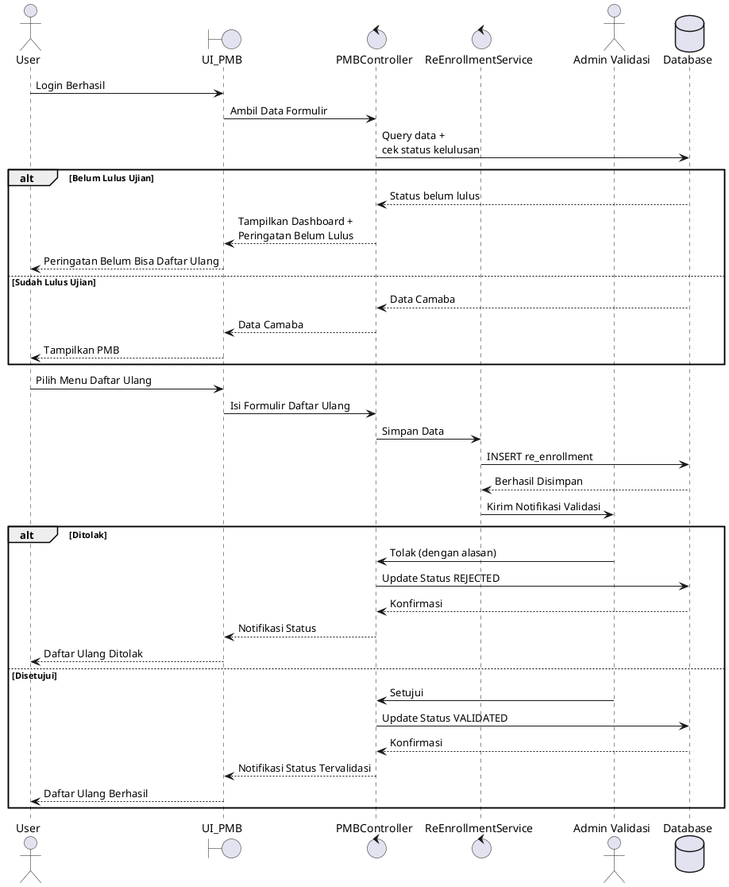

---

## D11. `class-diagram.png`

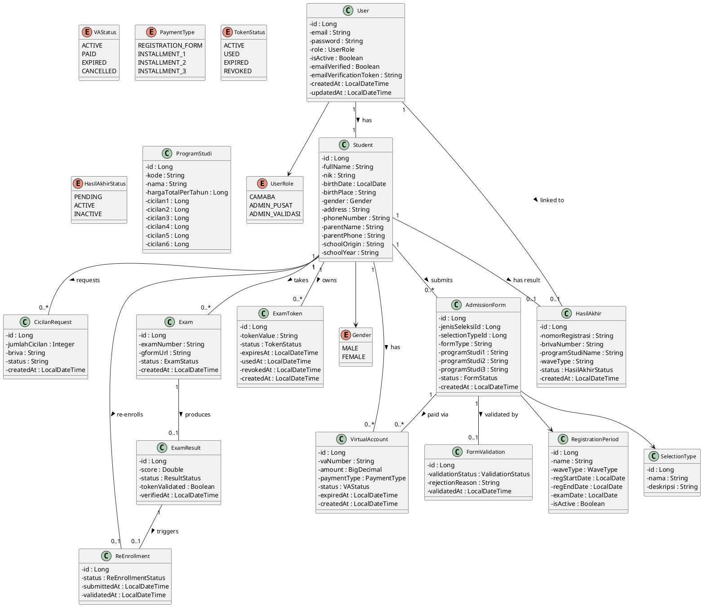

---

## D12. `erd.png`

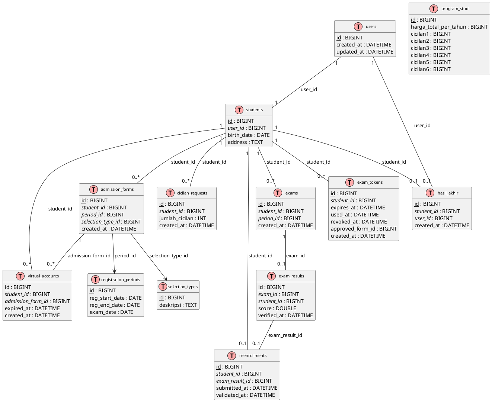
