# Use Case Diagram PMB UHN — PlantUML Source

Diagram ini menggambarkan seluruh use case sistem PMB berdasarkan kebutuhan fungsional terbaru.
BRIVA dan Google Form bukan aktor — keduanya adalah layanan eksternal yang dipanggil oleh sistem.

## PlantUML Code

```plantuml
@startuml PMB_UseCase

skinparam actorStyle awesome
skinparam usecase {
    BackgroundColor LightYellow
    BorderColor DarkSlateGray
    ArrowColor Navy
    ActorBorderColor DarkSlateGray
    ActorBackgroundColor White
}
skinparam linetype ortho
skinparam nodesep 40
skinparam ranksep 60

' ─────────────────────────────────────────────
' AKTOR INTERNAL (manusia)
' ─────────────────────────────────────────────
actor "Camaba\n(Calon Mahasiswa)" as Camaba
actor "Admin Pusat"               as AdminPusat
actor "Admin Validasi"            as AdminVal

' ─────────────────────────────────────────────
' SISTEM UTAMA
' ─────────────────────────────────────────────
rectangle "Sistem PMB UHN" as PMB {

    ' ── AUTENTIKASI ──────────────────────────
    usecase "Registrasi Akun"               as UC_Reg      #PaleTurquoise
    usecase "Login Multi-Level"             as UC_Login    #PaleTurquoise
    usecase "Lupa Password / Username"      as UC_ForgotPw #PaleTurquoise

    ' ── ALUR CAMABA ──────────────────────────
    usecase "Melihat Informasi Pendaftaran" as UC_Info     #LightGreen
    usecase "Memilih Gelombang &\nJenis Seleksi" as UC_Pilih #LightGreen
    usecase "Mengisi Formulir Pendaftaran"  as UC_Form     #LightGreen
    usecase "Melakukan Pembayaran\n(BRIVA / Manual)" as UC_Pay  #LightGreen
    usecase "Mencetak Kartu Ujian"          as UC_Card     #LightGreen
    usecase "Mengikuti Ujian"               as UC_Exam     #LightGreen
    usecase "Melihat Hasil Kelulusan"       as UC_Result   #LightGreen
    usecase "Mengajukan Cicilan"            as UC_Cicilan  #LightGreen
    usecase "Melakukan Daftar Ulang"        as UC_Reenrollment #LightGreen
    usecase "Mengirim Pertanyaan ke Admin"  as UC_Chat     #LightGreen

    ' ── SISTEM: NOTIFIKASI & VA ──────────────
    usecase "Generate VA Otomatis\n(BRIVA API)" as UC_GenVA  #Lavender
    usecase "Verifikasi Pembayaran\n(BRIVA API)" as UC_VerifPay #Lavender
    usecase "Kirim Email Notifikasi\n(SMTP Gmail)" as UC_Email #Lavender
    usecase "Tampilkan Ujian Online\n(Google Form iframe)" as UC_GForm #Lavender
    usecase "Publikasi Hasil Otomatis\n(Scheduled Task)" as UC_PubAuto #Lavender

    ' ── ADMIN PUSAT ──────────────────────────
    usecase "Mengelola Periode Penerimaan"  as UC_Period   #LightSalmon
    usecase "Menentukan Jenis Seleksi\nper Periode" as UC_SelType #LightSalmon
    usecase "Menetapkan Harga Formulir"    as UC_Price    #LightSalmon
    usecase "Mengelola Informasi &\nPengumuman (CRUD)" as UC_Info2 #LightSalmon
    usecase "Mengatur Link Ujian &\nToken Ujian" as UC_ExamLink #LightSalmon
    usecase "Mengelola Konten\nDaftar Ulang" as UC_ReContent #LightSalmon
    usecase "Menjadwalkan Publikasi\nHasil Kelulusan" as UC_Schedule #LightSalmon
    usecase "Manajemen Akun Pengguna"      as UC_UserMgmt #LightSalmon
    usecase "Menetapkan Tarif Cicilan\nper Program Studi" as UC_CicilanRate #LightSalmon

    ' ── ADMIN VALIDASI ───────────────────────
    usecase "Validasi Data Pendaftaran\nCamaba" as UC_Validate #LightBlue
    usecase "Validasi Berkas Jalur\nRanking" as UC_Ranking  #LightBlue
    usecase "Generate VA Manual"           as UC_ManualVA  #LightBlue
    usecase "Menyetujui / Menolak\nPermintaan Cicilan" as UC_ApproveCicilan #LightBlue
    usecase "Menentukan Status\nKelulusan Ujian" as UC_PassFail #LightBlue
    usecase "Akses & Ekspor Data\nPeserta Ujian" as UC_ExportExam #LightBlue
    usecase "Akses & Ekspor Data\nCamaba Lulus" as UC_ExportPass #LightBlue
    usecase "Klasifikasi Data\n(Fakultas / Prodi)" as UC_Classify #LightBlue
    usecase "Mengirim Pesan ke Camaba"     as UC_MsgCamaba #LightBlue
    usecase "Menjawab Pertanyaan Camaba"   as UC_Reply     #LightBlue
}

' ─────────────────────────────────────────────
' LAYANAN EKSTERNAL (bukan aktor, komponen luar)
' ─────────────────────────────────────────────
rectangle "<<external system>>\nBRI Virtual Account\n(BRIVA API)" as BrivaExt #LightGray
rectangle "<<external system>>\nGoogle Form\n(iframe embed)" as GFormExt #LightGray
rectangle "<<external system>>\nGmail SMTP\n(Email Notification)" as SmtpExt #LightGray

' ─────────────────────────────────────────────
' RELASI: CAMABA
' ─────────────────────────────────────────────
Camaba --> UC_Reg
Camaba --> UC_Login
Camaba --> UC_ForgotPw
Camaba --> UC_Info
Camaba --> UC_Pilih
Camaba --> UC_Form
Camaba --> UC_Pay
Camaba --> UC_Card
Camaba --> UC_Exam
Camaba --> UC_Result
Camaba --> UC_Cicilan
Camaba --> UC_Reenrollment
Camaba --> UC_Chat

' ─────────────────────────────────────────────
' RELASI: ADMIN PUSAT
' ─────────────────────────────────────────────
AdminPusat --> UC_Login
AdminPusat --> UC_Period
AdminPusat --> UC_SelType
AdminPusat --> UC_Price
AdminPusat --> UC_Info2
AdminPusat --> UC_ExamLink
AdminPusat --> UC_ReContent
AdminPusat --> UC_Schedule
AdminPusat --> UC_UserMgmt
AdminPusat --> UC_CicilanRate

' ─────────────────────────────────────────────
' RELASI: ADMIN VALIDASI
' ─────────────────────────────────────────────
AdminVal --> UC_Login
AdminVal --> UC_Validate
AdminVal --> UC_Ranking
AdminVal --> UC_ManualVA
AdminVal --> UC_ApproveCicilan
AdminVal --> UC_PassFail
AdminVal --> UC_ExportExam
AdminVal --> UC_ExportPass
AdminVal --> UC_Classify
AdminVal --> UC_MsgCamaba
AdminVal --> UC_Reply

' ─────────────────────────────────────────────
' INCLUDE / EXTEND RELASI ANTAR USE CASE
' ─────────────────────────────────────────────
UC_Pay       ..> UC_GenVA     : <<include>>
UC_Pay       ..> UC_VerifPay  : <<extend>>
UC_Exam      ..> UC_GForm     : <<include>>
UC_Validate  ..> UC_Email     : <<include>>
UC_Cicilan   ..> UC_Email     : <<include>>
UC_Reg       ..> UC_Email     : <<include>>
UC_Schedule  ..> UC_PubAuto   : <<include>>
UC_ManualVA  ..> UC_Email     : <<include>>
UC_Form      ..> UC_Card      : <<include>>

' ─────────────────────────────────────────────
' RELASI LAYANAN EKSTERNAL KE USE CASE SISTEM
' ─────────────────────────────────────────────
UC_GenVA   ..> BrivaExt  : <<calls>>
UC_VerifPay ..> BrivaExt : <<calls>>
UC_GForm   ..> GFormExt  : <<embeds>>
UC_Email   ..> SmtpExt   : <<sends via>>

@enduml
```

---

## Definisi Aktor (Setelah Perbaikan)

| Aktor | Tipe | Deskripsi |
|-------|------|-----------|
| Camaba (Calon Mahasiswa) | Internal – Human | Pengguna utama yang melakukan seluruh alur pendaftaran: registrasi, pemilihan gelombang, pengisian formulir, pembayaran, ujian, dan daftar ulang. |
| Admin Pusat | Internal – Human | Mengelola konfigurasi sistem secara menyeluruh: gelombang pendaftaran, jenis seleksi, harga formulir, jadwal publikasi hasil, dan akun pengguna. |
| Admin Validasi | Internal – Human | Melakukan validasi data camaba, mengelola cicilan, mengekspor data, serta berkomunikasi dengan camaba. |

---

## Definisi Layanan Eksternal (bukan aktor)

| Layanan | Tipe | Keterangan |
|---------|------|------------|
| BRIVA API (BRI Virtual Account) | External System | Dipanggil oleh sistem untuk membuat nomor VA otomatis dan memverifikasi pembayaran. Bukan aktor karena tidak memiliki inisiatif — hanya merespons panggilan API dari sistem. |
| Google Form (GForm) | External System | Ditampilkan dalam `<iframe>` sebagai media soal ujian online. Tidak berinteraksi langsung dengan aktor manusia di dalam sistem PMB. |
| Gmail SMTP | External System | Protokol/layanan pengiriman email. Dipanggil oleh sistem secara otomatis untuk notifikasi. |

---

## Daftar Use Case berdasarkan Kebutuhan Fungsional

| ID Kebutuhan | Use Case | Aktor Utama |
|---|---|---|
| PMB01-F040 | Registrasi Akun | Camaba |
| PMB01-F041 | Lupa Password / Username | Camaba |
| PMB01-F042 | Login Multi-Level | Camaba, Admin Pusat, Admin Validasi |
| PMB01-F002 | Mengelola Periode Penerimaan | Admin Pusat |
| PMB01-F003 | Menentukan Jenis Seleksi per Periode | Admin Pusat |
| PMB01-F004 | Menetapkan Harga Formulir | Admin Pusat |
| PMB01-F005 | Mengelola Informasi & Pengumuman | Admin Pusat |
| PMB01-F007 | Mengatur Link Ujian & Token | Admin Pusat |
| PMB01-F008 | Mengelola Konten Daftar Ulang | Admin Pusat |
| PMB01-F009 | Menjadwalkan Publikasi Hasil | Admin Pusat |
| PMB01-F010 | Manajemen Akun Pengguna | Admin Pusat |
| PMB01-F011 | Menetapkan Tarif Cicilan per Prodi | Admin Pusat, Admin Validasi |
| PMB01-F043 | Memilih Gelombang & Jenis Seleksi | Camaba |
| PMB01-F047 | Mengisi Formulir Pendaftaran | Camaba |
| PMB01-F012, F016, F017 | Melakukan Pembayaran (BRIVA/Manual) | Camaba |
| PMB01-F015, F017 | Generate VA Otomatis (via BRIVA API) | Sistem |
| PMB01-F018 | Mencetak Kartu Ujian | Camaba |
| PMB01-F021, F022, F045 | Mengikuti Ujian | Camaba |
| PMB01-F013 | Melihat Hasil Kelulusan | Camaba |
| PMB01-F012 | Mengajukan Cicilan | Camaba |
| PMB01-F046, F047 | Melakukan Daftar Ulang | Camaba |
| PMB01-F044 | Mengirim Pertanyaan ke Admin | Camaba |
| PMB01-F023 | Validasi Data Pendaftaran Camaba | Admin Validasi |
| PMB01-F028 | Validasi Berkas Jalur Ranking | Admin Validasi |
| PMB01-F027 | Generate VA Manual | Admin Validasi |
| PMB01-F033 | Penolakan Data / Revisi | Admin Validasi |
| PMB01-F029 | Akses & Ekspor Data Peserta Ujian | Admin Validasi |
| PMB01-F030, F031, F032 | Akses & Ekspor Data Camaba Lulus | Admin Validasi |
| PMB01-F034, F035 | Mengirim Pesan & Menjawab Pertanyaan | Admin Validasi |
| PMB01-F019, F020 | Kirim Email Notifikasi (via SMTP) | Sistem |
| PMB01-F013 | Publikasi Hasil Otomatis (Scheduled Task) | Sistem |

---

## Catatan Perbaikan Use Case

### Masalah Sebelumnya
- BRIVA dan GForm (Google Form) sebelumnya terdaftar sebagai **aktor** dalam tabel definisi aktor. Ini **salah** karena keduanya adalah layanan eksternal yang dipanggil oleh sistem, bukan entitas yang memiliki **inisiatif** untuk berinteraksi dengan sistem.
- Dalam UML, aktor harus berupa entitas yang **memulai interaksi** (initiator) atau **menerima nilai** dari sistem. BRIVA dan GForm tidak memiliki peran ini.

### Perbaikan
- BRIVA dan GForm dihapus dari tabel aktor.
- Keduanya digambarkan sebagai **external system** di luar batas sistem PMB.
- Interaksi dengan layanan ini dimodelkan sebagai `<<calls>>` dan `<<embeds>>` dari use case internal sistem, bukan sebagai relasi aktor.
- Definisi aktor sekarang hanya mencakup: **Camaba**, **Admin Pusat**, dan **Admin Validasi**.
