# Class Diagram — Sistem PMB UHN

> Seluruh nama class, atribut, dan operasi diambil langsung dari source code aktual (`entity/` + `service/`).
>
> **Strategi Diagram:** Diagram dipecah per domain agar tetap terbaca.  
> Tiap domain memuat: **Entity** (atribut) + **Service** (operasi/method) + **Relasi**.
>
> | # | Diagram | Isi |
> |---|---|---|
> | 1 | [Overview Sistem](#1-overview-sistem) | Semua class — nama saja, tanpa detail |
> | 2 | [Auth & Pengguna](#2-domain-auth--pengguna) | User, Student, AuthService |
> | 3 | [Pendaftaran & Formulir](#3-domain-pendaftaran--formulir) | AdmissionForm, FormValidation, services |
> | 4 | [Ujian](#4-domain-ujian) | Exam, ExamResult, ExamToken, services |
> | 5 | [Pembayaran](#5-domain-pembayaran) | VirtualAccount, CicilanRequest, HasilAkhir, services |
> | 6 | [Daftar Ulang](#6-domain-daftar-ulang) | ReEnrollment, dokumen, services |
> | 7 | [Komunikasi & Sistem](#7-domain-komunikasi--sistem) | Notification, Announcement, services |

---

## 1. Overview Sistem

> Semua kelas dalam satu pandangan — hanya nama class dan relasi utama (tanpa atribut/operasi detail).

```mermaid
classDiagram

class User
class Student
class PasswordResetToken
class RegistrationStatus
class AuthService

class RegistrationPeriod
class ProgramStudi
class JenisSeleksi
class SelectionType
class FormulaSelection
class PeriodJenisSeleksi
class SelectionProgramStudi
class Sma

class AdmissionForm
class StudentFormData
class FormValidation
class ValidationStatusTracker
class FormRepairStatus
class DocumentVerification

class Exam
class ExamQuestion
class ExamResult
class ExamToken
class ExamSubmission
class ExamLink
class GelombangLinkUjian

class VirtualAccount
class PaymentBriva
class CicilanRequest
class UniversityBankAccount
class HasilAkhir

class ReEnrollment
class ReEnrollmentDocument
class ReEnrollmentValidation
class ReEnrollmentData
class StudentNPM

class Notification
class AdminMessage
class Announcement
class EmailLog

class SystemConfiguration
class SystemLink
class ContactInfo
class PublicationSchedule

%% === RELASI UTAMA ===
User --> Student : has
User --> AuthService : authenticatedBy
Student --> AdmissionForm : submits
Student --> Exam : takes
Student --> ReEnrollment : registers
Student --> VirtualAccount : has
AdmissionForm --> FormValidation : validated
AdmissionForm --> CicilanRequest : installment
RegistrationPeriod --> SelectionType : has
RegistrationPeriod --> JenisSeleksi : via PeriodJenisSeleksi
JenisSeleksi --> ProgramStudi : via SelectionProgramStudi
Exam --> ExamResult : yields
ExamToken --> ExamSubmission : usedIn
ExamResult --> ReEnrollment : triggers
VirtualAccount --> PaymentBriva : brivaPayment
CicilanRequest --> HasilAkhir : finalizes
ReEnrollment --> ReEnrollmentDocument : has
ReEnrollment --> ReEnrollmentValidation : validated
User --> Notification : receives
User --> AdminMessage : sends
```

---

## 2. Domain Auth & Pengguna

> Entity: `User`, `Student`, `PasswordResetToken`, `RegistrationStatus`  
> Service: `AuthService`

```mermaid
classDiagram

%% ── INTERFACE ─────────────────────────────────────────────
class UserDetails {
    <<interface>>
    +getAuthorities() Collection
    +getUsername() String
    +getPassword() String
    +isAccountNonExpired() Boolean
    +isAccountNonLocked() Boolean
    +isCredentialsNonExpired() Boolean
    +isEnabled() Boolean
}

%% ── ENTITY ────────────────────────────────────────────────
class User {
    <<entity>>
    -Long id
    -String email
    -String password
    -UserRole role
    -Boolean isActive
    -Boolean emailVerified
    -String emailVerificationToken
    -LocalDateTime createdAt
    -LocalDateTime updatedAt
    +getAuthorities() Collection
    +getUsername() String
    +getPassword() String
    +isEnabled() Boolean
    +isAccountNonExpired() Boolean
    +isAccountNonLocked() Boolean
    +isCredentialsNonExpired() Boolean
}

class Student {
    <<entity>>
    -Long id
    -String fullName
    -String nik
    -LocalDate birthDate
    -String birthPlace
    -Gender gender
    -String address
    -String phoneNumber
    -String parentName
    -String parentPhone
    -String schoolOrigin
    -String schoolYear
    -LocalDateTime createdAt
    -LocalDateTime updatedAt
}

class PasswordResetToken {
    <<entity>>
    -Long id
    -String token
    -LocalDateTime expiryDate
    -Boolean isUsed
    -LocalDateTime createdAt
    +isExpired() Boolean
}

class RegistrationStatus {
    <<entity>>
    -Long id
    -RegistrationStage stage
    -RegistrationStatusEnum status
    -LocalDateTime submissionDate
    -Boolean canEdit
    -Boolean adminVerified
    -String verifiedBy
    -LocalDateTime editDeadline
    -LocalDateTime createdAt
    -LocalDateTime updatedAt
}

%% ── SERVICE ───────────────────────────────────────────────
class AuthService {
    <<service>>
    +register(request) AuthResponse
    +login(request) AuthResponse
    +verifyEmail(token) AuthResponse
    +resendVerificationEmail(email) AuthResponse
    +forgotPassword(email) AuthResponse
    +resetPassword(token, password, confirm) AuthResponse
    +validateToken(token) Boolean
}

%% ── RELASI ────────────────────────────────────────────────
UserDetails <|.. User : implements

User "1" --> "0..1" Student : hasProfile
User "1" --> "*" PasswordResetToken : has
User "1" --> "*" RegistrationStatus : trackedBy
Student "1" --> "1" User : account
AuthService --> User : manages
AuthService --> PasswordResetToken : generates
```

---

## 3. Domain Pendaftaran & Formulir

> Entity: `RegistrationPeriod`, `ProgramStudi`, `JenisSeleksi`, `SelectionType`, `PeriodJenisSeleksi`, `SelectionProgramStudi`, `AdmissionForm`, `FormValidation`, `ValidationStatusTracker`, `FormRepairStatus`, `DocumentVerification`  
> Service: `RegistrationPeriodService`, `ProgramStudiService`, `JenisSeleksiService`, `AdmissionFormService`, `FormValidationService`

```mermaid
classDiagram

%% ── ENTITY ────────────────────────────────────────────────
class RegistrationPeriod {
    <<entity>>
    -Long id
    -String name
    -LocalDateTime regStartDate
    -LocalDateTime regEndDate
    -LocalDateTime examDate
    -LocalDateTime examEndDate
    -LocalDateTime announcementDate
    -LocalDateTime reenrollmentStartDate
    -LocalDateTime reenrollmentEndDate
    -String description
    -String requirements
    -WaveType waveType
    -PeriodStatus status
    -LocalDateTime createdAt
    -LocalDateTime updatedAt
}

class ProgramStudi {
    <<entity>>
    -Long id
    -String kode
    -String nama
    -String fakultas
    -String deskripsi
    -Boolean isMedical
    -Boolean isActive
    -Integer sortOrder
    -Long hargaTotalPerTahun
    -Long cicilan1
    -Long cicilan2
    -Long cicilan3
    -Long cicilan4
    -Long cicilan5
    -Long cicilan6
    -LocalDateTime createdAt
    -LocalDateTime updatedAt
}

class JenisSeleksi {
    <<entity>>
    -Long id
    -String code
    -String nama
    -String deskripsi
    -String fasilitas
    -String logoUrl
    -BigDecimal harga
    -Boolean isActive
    -Integer sortOrder
    -LocalDateTime createdAt
    -LocalDateTime updatedAt
}

class SelectionType {
    <<entity>>
    -Long id
    -String name
    -String description
    -Boolean requireRanking
    -Boolean requireTesting
    -FormType formType
    -BigDecimal price
    -Boolean isActive
    -LocalDateTime createdAt
    -LocalDateTime updatedAt
}

class PeriodJenisSeleksi {
    <<entity>>
    -Long id
    -Boolean isActive
    -LocalDateTime createdAt
    -LocalDateTime updatedAt
}

class SelectionProgramStudi {
    <<entity>>
    -Long id
    -Boolean isActive
    -LocalDateTime createdAt
    -LocalDateTime updatedAt
}

class AdmissionForm {
    <<entity>>
    -Long id
    -Long jenisSeleksiId
    -Long selectionTypeId
    -FormType formType
    -String programStudi1
    -String programStudi2
    -String programStudi3
    -String fullName
    -String nik
    -String gender
    -String religion
    -String birthPlace
    -String birthDate
    -String phoneNumber
    -String email
    -String fatherName
    -String fatherNik
    -String motherName
    -String motherNik
    -String schoolOrigin
    -String nisn
    -String photoIdPath
    -String certificatePath
    -String transcriptPath
    -String nilaiFilePath
    -String rankingFilePath
    -PaymentMethod paymentMethod
    -FormStatus status
    -LocalDateTime submittedAt
    -LocalDateTime createdAt
    -LocalDateTime updatedAt
}

class FormValidation {
    <<entity>>
    -Long id
    -ValidationStatus validationStatus
    -PaymentStatus paymentStatus
    -String rejectionReason
    -String rejectionTopic
    -Integer revisionNumber
    -String virtualAccountNumber
    -Long paymentAmount
    -LocalDateTime paymentDate
    -String examToken
    -LocalDateTime createdAt
    -LocalDateTime validatedAt
    -LocalDateTime rejectedAt
    -LocalDateTime updatedAt
}

class ValidationStatusTracker {
    <<entity>>
    -Long id
    -ValidationStatusEnum status
    -String lastReason
    -String lastAction
    -LocalDateTime createdAt
    -LocalDateTime updatedAt
}

class FormRepairStatus {
    <<entity>>
    -Long id
    -RepairStatus status
    -String notes
    -LocalDateTime createdAt
    -LocalDateTime updatedAt
}

class DocumentVerification {
    <<entity>>
    -Long id
    -DocumentType documentType
    -String fileUrl
    -VerificationStatus status
    -String rejectionReason
    -LocalDateTime uploadDate
    -LocalDateTime verifiedDate
}

%% ── SERVICE ───────────────────────────────────────────────
class AdmissionFormService {
    <<service>>
    +checkSubmissionStatus(userEmail) Map
    +getAdmissionFormData(userEmail) Map
    +getCurrentAdmissionFormData(userEmail) Map
    +updateAdmissionFormData(userEmail, request) Map
    +submitAdmissionForm(userEmail, request) Map
    +updateAdmissionFormSelection(userEmail, request) Map
    +registerForAdmission(userEmail, periodId) AdmissionForm
    +getAdmissionStatus(userEmail) List
    +submitRevision(userEmail, formId, request) Map
}

class FormValidationService {
    <<service>>
    +findAll() List
    +findById(id) Optional
    +approve(validationId, admin) void
    +reject(validationId, request, admin) void
    +markRevisionNeeded(validationId, request, admin) void
    +getFormsForValidationDashboard() List
    +getFormDetails(formValidationId) Map
    +getAdmissionFormStudentDetails(studentId) Map
    +updateRepairStatus(studentId, repairStatus) Map
}

class RegistrationPeriodService {
    <<service>>
    +findAll() List
    +findById(id) Optional
    +create(request) RegistrationPeriod
    +update(id, request) RegistrationPeriod
    +delete(id) void
}

class ProgramStudiService {
    <<service>>
    +findAll() List
    +findAllActive() List
    +findById(id) Optional
    +create(request) ProgramStudi
    +update(id, request) ProgramStudi
    +delete(id) void
}

class JenisSeleksiService {
    <<service>>
    +getAllActive() List
    +getAll() List
    +getById(id) Optional
    +getByCode(code) Optional
    +create(jenisSeleksi) JenisSeleksi
    +createWithProgramStudi(request) JenisSeleksi
    +update(id, updates) JenisSeleksi
    +updateWithProgramStudi(id, request) JenisSeleksi
    +delete(id) void
    +toggleActive(id) JenisSeleksi
}

%% ── RELASI ────────────────────────────────────────────────
RegistrationPeriod "1" --> "*" SelectionType : has
RegistrationPeriod "1" --> "*" PeriodJenisSeleksi : includes
PeriodJenisSeleksi "*" --> "1" JenisSeleksi : jenisSeleksi
JenisSeleksi "1" --> "*" SelectionProgramStudi : offers
SelectionProgramStudi "*" --> "1" ProgramStudi : programStudi
SelectionType "*" --> "1" RegistrationPeriod : period

AdmissionForm "*" --> "1" RegistrationPeriod : inPeriod
AdmissionForm "1" --> "*" FormValidation : validatedVia
AdmissionForm "1" --> "0..1" ValidationStatusTracker : statusTracked
FormValidation "1" --> "*" FormRepairStatus : repairTracked

AdmissionFormService --> AdmissionForm : manages
FormValidationService --> FormValidation : manages
FormValidationService --> FormRepairStatus : manages
RegistrationPeriodService --> RegistrationPeriod : manages
ProgramStudiService --> ProgramStudi : manages
JenisSeleksiService --> JenisSeleksi : manages
```

---

## 4. Domain Ujian

> Entity: `Exam`, `ExamQuestion`, `ExamResult`, `ExamToken`, `ExamSubmission`, `ExamLink`, `GelombangLinkUjian`  
> Service: `ExamService`, `ExamTokenService`

```mermaid
classDiagram

%% ── ENTITY ────────────────────────────────────────────────
class Exam {
    <<entity>>
    -Long id
    -String examNumber
    -String gformUrl
    -String gformResponseId
    -ExamStatus status
    -LocalDateTime startedAt
    -LocalDateTime completedAt
    -String adminNotes
    -LocalDateTime createdAt
    -LocalDateTime updatedAt
}

class ExamQuestion {
    <<entity>>
    -Long id
    -QuestionCategory category
    -String subject
    -QuestionDifficulty difficulty
    -String questionText
    -String optionA
    -String optionB
    -String optionC
    -String optionD
    -String optionE
    -String correctAnswer
    -String explanation
    -ApprovalStatus approvalStatus
    -String rejectionReason
    -LocalDateTime createdAt
    -LocalDateTime approvedAt
}

class ExamResult {
    <<entity>>
    -Long id
    -Double score
    -ResultStatus status
    -String admissionNumber
    -String admissionPassword
    -LocalDateTime publishedAt
    -String studentInputToken
    -String generatedToken
    -String proofPhotoPath
    -Double gformScore
    -Boolean tokenValidated
    -ExamValidationStatus examValidationStatus
    -String adminNotes
    -LocalDateTime examValidatedAt
    -LocalDateTime submissionDate
    -LocalDateTime createdAt
    -LocalDateTime updatedAt
}

class ExamToken {
    <<entity>>
    -Long id
    -String tokenValue
    -TokenStatus status
    -LocalDateTime createdAt
    -LocalDateTime expiresAt
    -LocalDateTime usedAt
    -LocalDateTime revokedAt
    -Long approvedFormId
    +isActive() Boolean
    +isExpired() Boolean
}

class ExamSubmission {
    <<entity>>
    -Long id
    -String submissionData
    -Integer score
    -Boolean passed
    -String googleFormResponseId
    -SubmissionStatus status
    -LocalDateTime submittedAt
    -LocalDateTime scoreSyncedAt
    -LocalDateTime createdAt
    -LocalDateTime updatedAt
}

class ExamLink {
    <<entity>>
    -Long id
    -String linkTitle
    -String linkUrl
    -String description
    -Boolean isActive
    -LocalDateTime createdAt
    -LocalDateTime updatedAt
}

class GelombangLinkUjian {
    <<entity>>
    -Long id
    -String linkUjian
    -String examDate
    -String examPlace
    -String examTime
    -LocalDateTime createdAt
    -LocalDateTime updatedAt
}

%% ── SERVICE ───────────────────────────────────────────────
class ExamService {
    <<service>>
    +createLink(request) ExamLink
    +findLinksByPeriod(periodId) List
    +deleteLink(id) void
    +findResultByStudentId(studentId) Optional
    +validateSubmission(id, request, admin) ExamResult
}

class ExamTokenService {
    <<service>>
    +generateToken(studentId, formId, expMins) ExamToken
    +validateToken(tokenValue, studentId) ValidateTokenResponse
    +submitExamResult(request) ExamSubmission
    +revokeToken(tokenValue, reason) void
    +getValidatedStudentsWithTokens() List
    +getExamStatistics() Map
    +syncScoresFromGoogleForm() void
}

%% ── RELASI ────────────────────────────────────────────────
Exam "1" --> "0..1" ExamResult : yields
ExamResult "1" --> "1" Exam : resultOf
ExamToken "1" --> "*" ExamSubmission : usedIn
ExamSubmission "*" --> "0..1" ExamToken : usesToken

ExamService --> ExamLink : manages
ExamService --> ExamResult : validates
ExamTokenService --> ExamToken : manages
ExamTokenService --> ExamSubmission : records
```

---

## 5. Domain Pembayaran

> Entity: `VirtualAccount`, `PaymentBriva`, `CicilanRequest`, `UniversityBankAccount`, `HasilAkhir`  
> Service: `CamabaPaymentService`, `CicilanService`, `HasilAkhirService`

```mermaid
classDiagram

%% ── ENTITY ────────────────────────────────────────────────
class VirtualAccount {
    <<entity>>
    -Long id
    -String vaNumber
    -BigDecimal amount
    -PaymentType paymentType
    -VAStatus status
    -LocalDateTime paidAt
    -LocalDateTime expiredAt
    -String brivaReference
    -String paymentInfo
    -LocalDateTime createdAt
    -LocalDateTime updatedAt
}

class PaymentBriva {
    <<entity>>
    -Long id
    -String brivaCode
    -BigDecimal amount
    -PaymentPurpose purpose
    -PaymentStatus status
    -LocalDateTime dueDatetime
    -LocalDateTime paidDatetime
    -LocalDateTime createdAt
    -String brivaReference
    +isOverdue() Boolean
}

class CicilanRequest {
    <<entity>>
    -Long id
    -Integer jumlahCicilan
    -Long hargaCicilan1
    -Long hargaCicilan2
    -Long hargaCicilan3
    -Long hargaCicilan4
    -Long hargaCicilan5
    -Long hargaCicilan6
    -Long hargaTotal
    -Long hargaPerCicilan
    -String briva
    -PaymentMethod paymentMethod
    -CicilanRequestStatus status
    -String catatan
    -String approvedBy
    -LocalDateTime approvedAt
    -LocalDateTime createdAt
    -LocalDateTime updatedAt
}

class UniversityBankAccount {
    <<entity>>
    -Long id
    -String bankName
    -String accountNumber
    -String accountHolder
    -String purpose
    -Boolean isActive
    -LocalDateTime createdAt
    -LocalDateTime updatedAt
}

class HasilAkhir {
    <<entity>>
    -Long id
    -String brivaNumber
    -BigDecimal brivaAmount
    -Integer jumlahCicilan
    -String nomorRegistrasi
    -WaveType waveType
    -String selectionType
    -String programStudiName
    -String npmSementaraFile
    -String ktmSementaraFile
    -HasilAkhirStatus status
    -LocalDateTime createdAt
    -LocalDateTime updatedAt
}

%% ── SERVICE ───────────────────────────────────────────────
class CamabaPaymentService {
    <<service>>
    +createVirtualAccount(userEmail, selectionTypeId) Map
    +verifyPayment(userEmail, vaNumber) Map
    +checkPaymentStatus(userEmail, vaNumber) Map
    +simulatePayment(vaNumber) Map
    +buyForm(formId) Map
    +confirmCicilanPayment(userEmail) Map
}

class CicilanService {
    <<service>>
    +getCicilanByAdmissionFormId(formId) Optional
    +getMyCicilan(email) Optional
    +submitCicilanRequest(email, request) CicilanRequestDTO
    +markPaymentSubmitted(id, email) CicilanRequestDTO
}

class HasilAkhirService {
    <<service>>
    +createHasilAkhir(studentId, brivaNumber, nomorReg, amount) HasilAkhir
    +autoPopulateHasilAkhir(studentId) HasilAkhir
    +getHasilAkhirByStudentId(studentId) Optional
    +getHasilAkhirByUserId(userId) Optional
    +updateStatus(studentId, newStatus) void
    +studentHasHasilAkhir(studentId) Boolean
    +updateRegistrationNumberAndBriva(formValidationId, request) HasilAkhir
}

%% ── RELASI ────────────────────────────────────────────────
VirtualAccount "1" --> "0..1" PaymentBriva : brivaPayment

CamabaPaymentService --> VirtualAccount : manages
CamabaPaymentService --> PaymentBriva : manages
CicilanService --> CicilanRequest : manages
HasilAkhirService --> HasilAkhir : manages
CicilanRequest --> HasilAkhir : contributes
```

---

## 6. Domain Daftar Ulang

> Entity: `ReEnrollment`, `ReEnrollmentDocument`, `ReEnrollmentValidation`, `ReEnrollmentData`, `StudentNPM`  
> Service: `CamabaReenrollmentService`, `ReenrollmentService`

```mermaid
classDiagram

%% ── ENTITY ────────────────────────────────────────────────
class ReEnrollment {
    <<entity>>
    -Long id
    -String parentName
    -String parentPhone
    -String parentEmail
    -String parentAddress
    -String permanentAddress
    -String currentAddress
    -Boolean alumniFamily
    -String alumniName
    -String alumniRelation
    -String paktaIntegritasFile
    -String ijazahFile
    -String pasphotoFile
    -String kartuKeluargaFile
    -String ktpFile
    -String suratBebasNarkobaFile
    -String skckFile
    -ReEnrollmentStatus status
    -LocalDateTime submittedAt
    -LocalDateTime validatedAt
    -String validationNotes
    -LocalDateTime createdAt
    -LocalDateTime updatedAt
}

class ReEnrollmentDocument {
    <<entity>>
    -Long id
    -DocumentType documentType
    -String filePath
    -String originalFilename
    -Long fileSize
    -String fileMimeType
    -UploadStatus uploadStatus
    -ValidationStatus validationStatus
    -String adminNotes
    -LocalDateTime uploadedAt
    -LocalDateTime validatedAt
    -LocalDateTime createdAt
    -LocalDateTime updatedAt
}

class ReEnrollmentValidation {
    <<entity>>
    -Long id
    -ValidationStatus validationStatus
    -String rejectionReason
    -String rejectionTopic
    -LocalDateTime createdAt
    -LocalDateTime validatedAt
    -LocalDateTime rejectedAt
}

class ReEnrollmentData {
    <<entity>>
    -Long id
    -CicilanType cicilationType
    -LocalDateTime approvalDate
    -ReEnrollmentDataStatus status
    -LocalDateTime createdAt
    +getTotalCicilan() int
}

class StudentNPM {
    <<entity>>
    -Long id
    -String npm
    -LocalDateTime programmingStartDate
    -StudentStatus status
    -LocalDateTime issuedDate
}

%% ── SERVICE ───────────────────────────────────────────────
class CamabaReenrollmentService {
    <<service>>
    +submitReenrollment(userEmail, parentPhone, ...) Map
    +getReenrollmentStatus(userEmail) Map
    +completeReenrollment(userEmail, submittedAt) Map
    +getReenrollmentData(userEmail) Map
    +updateReenrollmentData(userEmail, id, ...) Map
    +getReenrollmentDocuments(userEmail, id) List
}

class ReenrollmentService {
    <<service>>
    +findPending() List
    +findById(id) Optional
    +approve(reEnrollmentId, admin) ReEnrollment
    +reject(reEnrollmentId, reason, topic, admin) ReEnrollment
    +validateDocument(docId, request, admin) ReEnrollmentDocument
    +finalize(id, request) ReEnrollment
}

%% ── RELASI ────────────────────────────────────────────────
ReEnrollment "1" --> "*" ReEnrollmentDocument : has
ReEnrollment "1" --> "*" ReEnrollmentValidation : validated

CamabaReenrollmentService --> ReEnrollment : manages
ReenrollmentService --> ReEnrollment : approves
ReenrollmentService --> ReEnrollmentDocument : validates
```

---

## 7. Domain Komunikasi & Sistem

> Entity: `Notification`, `AdminMessage`, `Announcement`, `EmailLog`, `SystemConfiguration`, `PublicationSchedule`, `SystemLink`, `ContactInfo`  
> Service: `AnnouncementService`, `PublicationScheduleService`

```mermaid
classDiagram

%% ── ENTITY ────────────────────────────────────────────────
class Notification {
    <<entity>>
    -Long id
    -String subject
    -String message
    -NotificationType type
    -NotificationStatus status
    -LocalDateTime sentAt
    -LocalDateTime readAt
    -String errorMessage
    -LocalDateTime createdAt
}

class AdminMessage {
    <<entity>>
    -Long id
    -String messageContent
    -String messageType
    -MessageStatus status
    -Long admissionFormId
    -LocalDateTime createdAt
    -LocalDateTime readAt
    -LocalDateTime repliedAt
}

class Announcement {
    <<entity>>
    -Long id
    -String title
    -String content
    -String description
    -String createdByName
    -Boolean isActive
    -Integer priority
    -AnnouncementType announcementType
    -LocalDateTime createdAt
    -LocalDateTime updatedAt
    -LocalDateTime publishedAt
}

class EmailLog {
    <<entity>>
    -Long id
    -String recipientEmail
    -String subject
    -EmailType emailType
    -LocalDateTime sentDate
    -Boolean successStatus
    -String errorMessage
    -String attachmentUrl
}

class SystemConfiguration {
    <<entity>>
    -Long id
    -String configKey
    -String configValue
    -String description
    -ConfigType configType
    -Boolean isActive
    -LocalDateTime createdAt
    -LocalDateTime updatedAt
}

class PublicationSchedule {
    <<entity>>
    -Long id
    -LocalDateTime publishDateTime
    -Boolean isPublished
    -LocalDateTime publishedAt
    -String createdBy
    -String notes
    -LocalDateTime createdAt
    -LocalDateTime updatedAt
    +isResultsVisible() Boolean
}

class SystemLink {
    <<entity>>
    -Integer id
    -String linkName
    -String linkType
    -String linkUrl
    -String description
    -Boolean isActive
    -LocalDateTime createdAt
    -LocalDateTime updatedAt
}

class ContactInfo {
    <<entity>>
    -Integer id
    -String address
    -String phone
    -String email
    -String operatingHours
    -LocalDateTime createdAt
    -LocalDateTime updatedAt
}

%% ── SERVICE ───────────────────────────────────────────────
class AnnouncementService {
    <<service>>
    +findAllActive() List
    +findAllActivePaginated(pageable) Page
    +findById(id) Optional
    +findActiveById(id) Announcement
    +findRecent() List
    +findUrgent() List
    +search(keyword) List
    +create(request, createdByName) Announcement
    +update(id, request) Announcement
    +delete(id) void
    +deactivate(id) Announcement
}

class PublicationScheduleService {
    <<service>>
    +getAllSchedules() List
    +getScheduleByPeriod(periodId) Map
    +createOrUpdate(periodId, dateTimeStr, notes, createdBy) Map
    +publishNow(periodId, createdBy) Map
    +deleteSchedule(id) void
}

%% ── RELASI ────────────────────────────────────────────────
AdminMessage "*" --> "0..1" AdminMessage : replyToParent

AnnouncementService --> Announcement : manages
PublicationScheduleService --> PublicationSchedule : manages
```

---

## Enum Lengkap per Kelas

| Kelas | Enum | Nilai |
|---|---|---|
| `User` | `UserRole` | `CAMABA`, `ADMIN_VALIDASI`, `ADMIN_PMB` |
| `Student` | `Gender` | `MALE`, `FEMALE` |
| `RegistrationPeriod` | `WaveType` | `EARLY_NO_TEST`, `RANKING_NO_TEST`, `REGULAR_TEST` |
| `RegistrationPeriod` | `PeriodStatus` | `OPEN`, `CLOSED`, `ARCHIVED` |
| `SelectionType` / `AdmissionForm` | `FormType` | `MEDICAL`, `NON_MEDICAL` |
| `AdmissionForm` | `FormStatus` | `DRAFT`, `SUBMITTED`, `VERIFIED`, `REJECTED`, `WAITING_PAYMENT` |
| `AdmissionForm` | `PaymentMethod` | `SIMULATION`, `MANUAL` |
| `FormValidation` | `ValidationStatus` | `PENDING`, `APPROVED`, `REJECTED`, `REVISION_NEEDED`, `SUSPENDED` |
| `FormValidation` | `PaymentStatus` | `PENDING`, `PAID`, `VERIFIED` |
| `ValidationStatusTracker` | `ValidationStatusEnum` | `NOT_STARTED`, `MENUNGGU`, `DIVALIDASI`, `DITOLAK`, `REVISI` |
| `FormRepairStatus` | `RepairStatus` | `BELUM_PERBAIKAN`, `SUDAH_PERBAIKAN` |
| `DocumentVerification` | `DocumentType` | `KARTU_KELUARGA`, `KTP`, `IJAZAH_SMA`, `NILAI_UTBK`, `SURAT_SEHAT` |
| `DocumentVerification` | `VerificationStatus` | `PENDING`, `VERIFIED`, `REJECTED` |
| `Exam` | `ExamStatus` | `PENDING`, `STARTED`, `COMPLETED`, `GRADED`, `SUBMITTED`, `NOT_STARTED` |
| `ExamQuestion` | `QuestionCategory` | `IPA`, `IPS`, `PSIKOTES`, `BAHASA` |
| `ExamQuestion` | `QuestionDifficulty` | `EASY`, `MEDIUM`, `HARD` |
| `ExamQuestion` | `ApprovalStatus` | `PENDING`, `APPROVED`, `REJECTED` |
| `ExamResult` | `ResultStatus` | `PASSED`, `FAILED`, `PENDING`, `PUBLISHED` |
| `ExamResult` | `ExamValidationStatus` | `PENDING`, `APPROVED`, `REJECTED`, `REVISI` |
| `ExamToken` | `TokenStatus` | `ACTIVE`, `USED`, `EXPIRED`, `REVOKED` |
| `ExamSubmission` | `SubmissionStatus` | `PENDING`, `SCORED`, `FAILED` |
| `VirtualAccount` | `PaymentType` | `REGISTRATION_FORM`, `INSTALLMENT_1`, `INSTALLMENT_2`, `INSTALLMENT_3` |
| `VirtualAccount` | `VAStatus` | `ACTIVE`, `PAID`, `EXPIRED`, `CANCELLED` |
| `PaymentBriva` | `PaymentPurpose` | `FORMULIR_REGISTRATION`, `DAFTAR_ULANG_CICILAN_1..4` |
| `PaymentBriva` | `PaymentStatus` | `PENDING`, `PAID`, `EXPIRED`, `FAILED` |
| `CicilanRequest` | `CicilanRequestStatus` | `PENDING`, `APPROVED`, `REJECTED` |
| `HasilAkhir` | `HasilAkhirStatus` | `PENDING`, `ACTIVE`, `EXPIRED`, `USED`, `CANCELLED` |
| `ReEnrollment` | `ReEnrollmentStatus` | `INCOMPLETE`, `SUBMITTED`, `VALIDATED`, `REJECTED` |
| `ReEnrollmentData` | `CicilanType` | `FULL_PAYMENT`, `CICILAN_2`, `CICILAN_3`, `CICILAN_4` |
| `ReEnrollmentData` | `ReEnrollmentDataStatus` | `PENDING`, `ASSIGNED`, `PARTIAL_PAID`, `FULLY_PAID`, `VERIFIED`, `REJECTED` |
| `StudentNPM` | `StudentStatus` | `ACTIVE`, `INACTIVE` |
| `Notification` | `NotificationType` | `REGISTRATION_CONFIRMATION`, `VA_GENERATED`, `PAYMENT_CONFIRMED`, `EXAM_READY`, `RESULT_PUBLISHED`, `REENROLLMENT_REMINDER`, `VALIDATION_REJECTED`, `VALIDATION_APPROVED`, `SYSTEM_MESSAGE` |
| `Notification` | `NotificationStatus` | `PENDING`, `SENT`, `FAILED`, `DELIVERED` |
| `AdminMessage` | `MessageStatus` | `UNREAD`, `READ`, `REPLIED` |
| `Announcement` | `AnnouncementType` | `GENERAL`, `UPCOMING`, `DEADLINE`, `MAINTENANCE`, `IMPORTANT`, `EVENT` |
| `EmailLog` | `EmailType` | `KARTU_UJIAN_NEW_REGISTRATION`, `NPM_ASSIGNMENT`, `CICILAN_PAYMENT_REMINDER`, `CICILAN_PAYMENT_OVERDUE`, `VERIFICATION_COMPLETE` |
| `SystemConfiguration` | `ConfigType` | `STRING`, `NUMBER`, `BOOLEAN`, `JSON`, `TEXT` |

